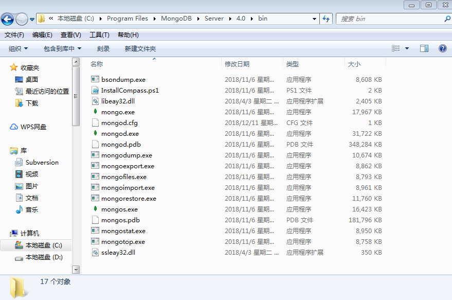
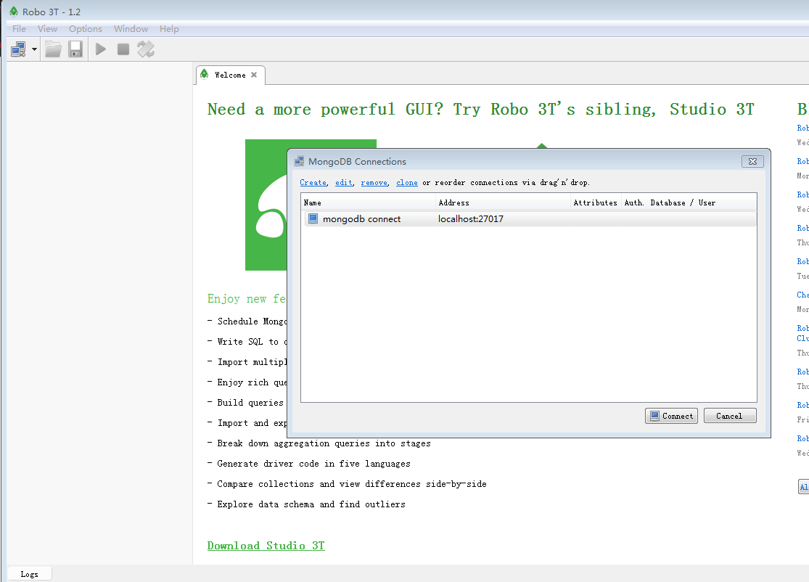

# mongodb


- 数据库,相当于Mysql
- 有类似Navicat可视化工具 Robo3T
- nosql数据库，非关系型数据库


在安装完mongodb.msi，你在电脑里面找到以下路径(根据你们安装路径)运找到bin目录，里面会有一些mongodb指令

```
C:\Program Files\MongoDB\Server\4.0\bin
```

# 创建数据库

在bin目录下，打开命令行，输入以下内容，路径一般别放C盘，别有中文路径
```
mongod --dbpath 路径

mongod --dbpach D:\1902\Node\day6\mongodb
```

就会在D:\1902\Node\day6\mongodb生成一堆文件



# 可视化工具

打开robo3T，执行连接



左上角，点击xxx connect右键，可以取创建数据库或者表===集合

# 配合Node来连接

登录npm包管理中心，查询mongodb的支持模块，选择对应的模块安装来去操作系统的mongodb数据库

你可以运用cnpm或者yarn来代替npm的安装

`npm init`在项目的目录下初始化一份`package.json`文件，它用于记录该项目的依赖模块，常用的命令组合，还有版本号，项目描述等,在安装其他模块的时候

```
npm i xxx --save /--save-dev # 记录安装的依赖，--save生产依赖(发布到线上) --save-dev开发依赖(在测试的时候使用)
```

```sh
npm init
npm install mongodb
cnpm install mongodb
yarn add mongodb
```

# 添加数据

```
const {MongoClient} = require('mongodb')
MongoClient.connect(url,{}),(err, client)=>{
	// 选库
	let db = client.db(dbName);
	// 选集合
	let collection = db.collection('collectionName');
	// 增
	collection.insertMany([])
	// 查
	collection.find({}).toArray()
})
```

# websocket

[node的文档](https://github.com/wscats/node-tutorial)